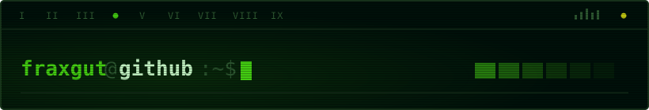

<!--
README.md
@fraxgut
CC-BY-SA-4.0
Profile landing page
-->

# Franco Gutiérrez

**Computer Science and Engineering student at the University of Chile (DCC/FCFM).** 
**Focused on systems, open source, Unix-like systems, and software engineering.**

Santiago, Chile

---

## Languages

*  **[Latine](i18n/la/README.md)**
*  **[Español](i18n/es/README.md)**
*  **[English](i18n/en/README.md)**

## About

I study Computer Science and Engineering at the
**University of Chile**, in the Department of Computer Science
(**DCC**) of the Faculty of Physical and Mathematical Sciences
(**FCFM**).

My main interests are systems, free and open-source software,
Unix-like operating systems, and software engineering. I tend to work
from the shell, primarily with Bash and Neovim.

## Current

My studies at the University of Chile are my primary focus, alongside
personal software projects and my work at
[**Venturas**](https://venturas.cl/).

## Selected work

| Project | Description |
| --- | --- |
| [**gentoo-musl-install-guide**](https://github.com/fraxgut/gentoo-musl-install-guide) | Advanced Gentoo installation documentation for AMD64 musl systems, covering OpenRC, LUKS2, Btrfs, LLVM/Clang, ThinLTO, and the Zen kernel. |
| [**frankifuscus**](https://github.com/fraxgut/frankifuscus) | A personal base16 colour scheme, in full colour and in monochrome. |

[View all public repositories →](https://github.com/fraxgut?tab=repositories)

## Contact

* **Email:** [franco.gutierrez.1@ug.uchile.cl](mailto:franco.gutierrez.1@ug.uchile.cl)
* **X:** [@fraxgut](https://x.com/fraxgut)
* **LinkedIn:** [in/fraxgut](https://www.linkedin.com/in/fraxgut)

## Support

Support for my public work is available through
[**Liberapay**](https://liberapay.com/fraxgut/) or cryptocurrency.

**Monero (XMR) preferred.**

---

     

**[CC BY-SA 4.0 or later](LICENCE.md)**

