<!--
i18n/en/README.md
@fraxgut
CC-BY-SA-4.0
Extended profile in English: the personal homepage of @fraxgut
-->

<div align="center">

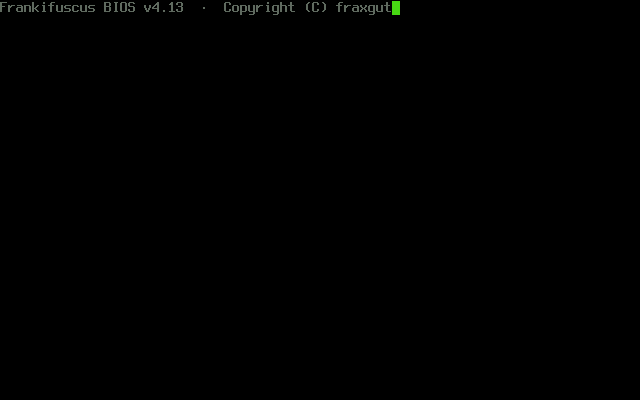

</div>

```
╔══════════════════════════════════════════════════════════════╗
║                                                              ║
║                       SALVE, VIATOR.                         ║
║                                                              ║
║           Welcome to Franco's corner of the Web.             ║
║                                                              ║
╚══════════════════════════════════════════════════════════════╝
```

<div align="center">

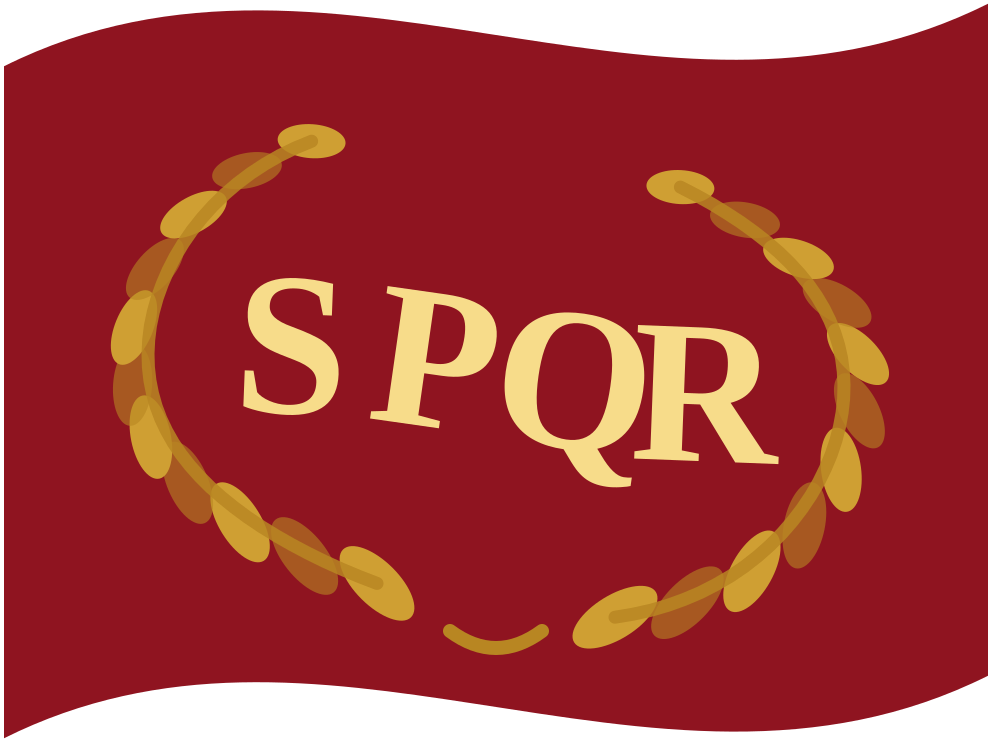 **[Latine](../la/README.md)** ·
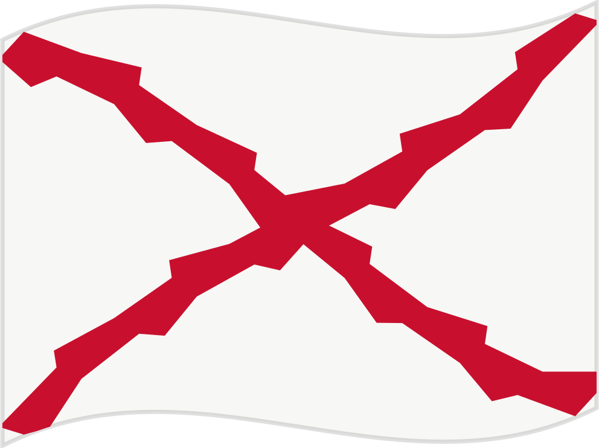 **[Español](../es/README.md)** ·
 **English** ·
[**Short version**](../../README.md)

</div>

---

## Whoami

```console
$ whoami
Franco Gutiérrez
```

I study Computer Science and Engineering at the Universidad de Chile. My
department is the DCC, inside the Faculty of Physical and Mathematical
Sciences. I live in Santiago.

I like the parts of computing that sit close to the machine: operating
systems, the shell, the toolchain, and the documentation that explains
how a system holds together. I write that documentation myself, and I
keep it in Latin, in Spanish and in English.

This page looks the way a personal page looked around 1999. The Web was
more fun when each person built one room of it by hand.

<div align="center">

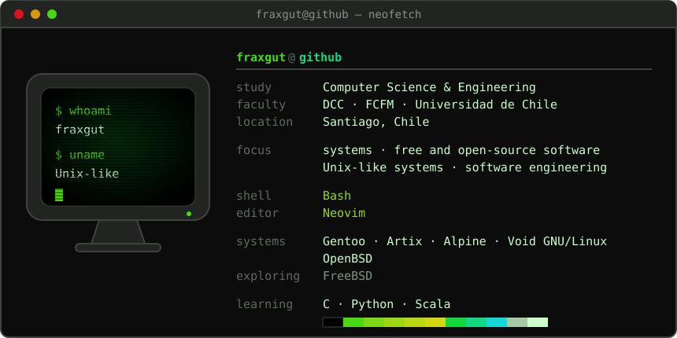

</div>

## The university

```
┌─ STUDY ──────────────────────────────────────────────────────┐
│                                                              │
│  degree      Ingeniería Civil en Computación                 │
│  department  Departamento de Ciencias de la Computación      │
│  faculty     Ciencias Físicas y Matemáticas                  │
│  university  Universidad de Chile                            │
│  city        Santiago, Chile                                 │
│                                                              │
└──────────────────────────────────────────────────────────────┘
```

The degree runs long and it holds most of my attention. It teaches me
the theory under the tools that I already use, and it puts languages in
front of me that I would not have chosen on my own. That is the point of
a university.

## Systems

I use Unix-like systems. No single one of them defines me, and I choose
the one that fits the machine and the task.

| System | Where it runs and why |
|---|---|
| **Gentoo GNU/Linux** | My main workstation. I build the toolchain the way I want it, and I wrote a guide about it. |
| **Artix GNU/Linux** | The same Arch packages, with OpenRC instead of systemd. |
| **Alpine Linux** | Small machines and containers. musl and BusyBox keep it lean. |
| **Void GNU/Linux** | runit, rolling releases, and a clean package manager. |
| **OpenBSD** | My servers. Correctness and a sober default install come first there. |
| **FreeBSD** | Next on the list. So far I have read more about it than I have run it. |

I write **GNU/Linux** where the system is GNU and Linux together, and
**OpenBSD** where it is a BSD. The names carry information, so I keep
them exact.

## Languages and tools

A university teaches you fast how much you still owe.

```
┌─ EVERY DAY ──────────────────────────────────────────────────┐
│  Bash · the shell · Neovim · Git · Markdown                  │
├─ COMFORTABLE ────────────────────────────────────────────────┤
│  HTML · CSS · JavaScript                                     │
├─ LEARNING NOW ───────────────────────────────────────────────┤
│  C · Python · Scala                                          │
├─ USED BEFORE ────────────────────────────────────────────────┤
│  Kotlin                                                      │
└──────────────────────────────────────────────────────────────┘
```

The shell is the tool I know best. C is the one I like most, and the one
I work hardest on. Python and Scala both come from coursework; Kotlin
comes from a job I had earlier.

## Projects

```
┌──────────────────────────────────────────────────────────────┐
│ gentoo-musl-install-guide                                    │
│                                                              │
│ An advanced Gentoo installation guide for AMD64 musl         │
│ systems. It stacks the hardened profile on musl/llvm, and    │
│ it states what each decision costs as well as what it gives. │
│                                                              │
│ [ OPENRC ] [ MUSL ] [ LUKS2 ] [ BTRFS ] [ LLVM ] [ ZEN ]     │
└──────────────────────────────────────────────────────────────┘
```

→ [**fraxgut/gentoo-musl-install-guide**](https://github.com/fraxgut/gentoo-musl-install-guide)

```
┌──────────────────────────────────────────────────────────────┐
│ frankifuscus                                                 │
│                                                              │
│ My personal base16 colour scheme, in two variants: the       │
│ full palette, and a phosphor monochrome for terminals.       │
│ Every colour on this page comes from it.                     │
│                                                              │
│ [ BASE16 ] [ PHOSPHOR ] [ TERMINAL ]                         │
└──────────────────────────────────────────────────────────────┘
```

→ [**fraxgut/frankifuscus**](https://github.com/fraxgut/frankifuscus)

Everything public sits in my
[repository list](https://github.com/fraxgut?tab=repositories).

## Elsewhere

I run **[Venturas](https://venturas.cl/)** part-time. It is my own small
venture, and the company behind it is DIMEX SpA. The projects there are
commercial, and they stay separate from the personal work on this
profile. The university comes first; Venturas fits in the time that is
left.

My own Git forge runs on Forgejo at `git.venturas.cl`. Most of what it
holds is private, so this profile stays the better place to find my
public work.

## The button wall

Made by hand, 88 by 31 pixels, the way the Web did it.

<div align="center">

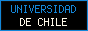
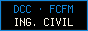
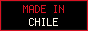
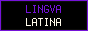
<br>
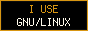

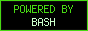
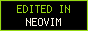
<br>
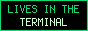
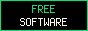
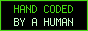
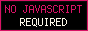
<br>
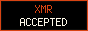
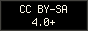

</div>

Take them if you want them. They carry the same licence as the rest of
this repository.

## Contact

```console
$ mail franco.gutierrez.1@ug.uchile.cl
```

- **Email:** [franco.gutierrez.1@ug.uchile.cl](mailto:franco.gutierrez.1@ug.uchile.cl)
- **X:** [@fraxgut](https://x.com/fraxgut)
- **LinkedIn:** [in/fraxgut](https://www.linkedin.com/in/fraxgut)

Email reaches me first, and it reaches me best.

## Support

If a guide or a piece of software of mine saved you an afternoon, you
can pay some of it back.

**[→ Liberapay](https://liberapay.com/fraxgut/)** — recurring support,
run by a non-profit.

<details>
<summary><b>Cryptocurrency</b> — Monero preferred</summary>

<br>

Monero is my preference, because it behaves like cash, and the amount
stays between the two of us.

| Currency | Address |
|---|---|
| **Monero (XMR)** · preferred | write to me |
| Bitcoin (BTC) | write to me |
| Ethereum (ETH) | write to me |
| Solana (SOL) | write to me |
| pUSD | write to me |

<!--
TODO(fraxgut): replace each "write to me" cell with the real address,
wrapped in backticks so the reader can copy it, for example:

| **Monero (XMR)** · preferred | `4A...` |

Check every address twice against your wallet before you commit it. A
public address with one wrong character sends the money nowhere.
-->

</details>

---

<div align="center">

```
╔═══════════════════════════════╗
║      YOU ARE VISITOR NO.      ║
╚═══════════════════════════════╝
```


<br><br>


**[CC BY-SA 4.0 or later](../../LICENCE.md)** · Franco Gutiérrez

`SALVE, VIATOR. VALE.`

</div>
