<!--
i18n/en/README.md
@fraxgut
CC-BY-SA-4.0
Extended profile in English
-->

 **[Latine](../la/README.md)** ·  **[Español](../es/README.md)** ·  **English**

---

# 𝕱𝖗𝖆𝖓𝖈𝖔 𝕲𝖚𝖙𝖎𝖊́𝖗𝖗𝖊𝖟

## About

I study **Computer Science and Engineering at the University of Chile
(DCC/FCFM)** in Santiago.

My main interests are systems, software engineering, free and
open-source software, and Unix-like environments. I generally work
from the shell, using **Bash** and **Neovim**.

## University

<table>
<tr><td><b>Degree</b></td><td>Ingeniería Civil en Computación</td></tr>
<tr><td><b>Department</b></td><td>Departamento de Ciencias de la Computación (DCC)</td></tr>
<tr><td><b>Faculty</b></td><td>Facultad de Ciencias Físicas y Matemáticas (FCFM)</td></tr>
<tr><td><b>University</b></td><td>Universidad de Chile</td></tr>
<tr><td><b>School</b></td><td>Instituto Nacional</td></tr>
<tr><td><b>Location</b></td><td>Santiago, Chile</td></tr>
</table>

## Computing

<table>
<tr><td><b>Shell</b></td><td>Bash</td></tr>
<tr><td><b>Editor</b></td><td>Neovim</td></tr>
<tr><td><b>Systems</b></td><td>GNU/Linux, BSD</td></tr>
<tr><td><b>Working with</b></td><td>C, Python, Scala</td></tr>
<tr><td><b>Web &amp; markup</b></td><td>HTML, CSS, JavaScript, Markdown</td></tr>
<tr><td><b>Other experience</b></td><td>Kotlin</td></tr>
</table>

## Projects

<table>
<tr>
<td width="96" align="center"></td>
<td>
<b>gentoo-musl-install-guide</b> 
Advanced Gentoo installation documentation for AMD64 musl systems,
covering OpenRC, LUKS2, Btrfs, LLVM/Clang, ThinLTO, and the Zen kernel. 
<a href="https://github.com/fraxgut/gentoo-musl-install-guide"><b>fraxgut/gentoo-musl-install-guide &rarr;</b></a>
</td>
</tr>
<tr>
<td width="96" align="center"></td>
<td>
<b>frankifuscus</b> 
A personal base16 colour scheme, in full colour and in monochrome. 
<a href="https://github.com/fraxgut/frankifuscus"><b>fraxgut/frankifuscus &rarr;</b></a>
</td>
</tr>
</table>

[**All public repositories →**](https://github.com/fraxgut?tab=repositories)

## Venturas

I run **[Venturas](https://venturas.cl/)**, where I keep my commercial
projects.

## Links

<a href="https://institutonacional.cl/">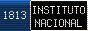</a> <a href="https://www.uchile.cl/">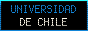</a> <a href="https://www.dcc.uchile.cl/">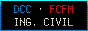</a> 

<a href="https://www.gnu.org/">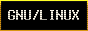</a>  <a href="https://www.gnu.org/software/bash/">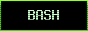</a> 

<a href="https://www.fsf.org/">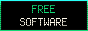</a> <a href="https://www.getmonero.org/">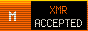</a>  <a href="../../LICENCE.md">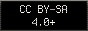</a>

## Contact

 <a href="https://x.com/fraxgut">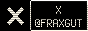</a> <a href="https://www.linkedin.com/in/fraxgut">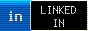</a>

Email: [franco.gutierrez.1@ug.uchile.cl](mailto:franco.gutierrez.1@ug.uchile.cl)

## Support

<a href="https://liberapay.com/fraxgut/">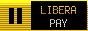</a> 

You can support my public work through
[**Liberapay**](https://liberapay.com/fraxgut/) or cryptocurrency.

**Monero (XMR) preferred.** Write to me for an address.

---

  

**[CC BY-SA 4.0 or later](../../LICENCE.md)** · Franco Gutiérrez

