<!--
i18n/la/README.md
@fraxgut
CC-BY-SA-4.0
Profile page in Latin
-->

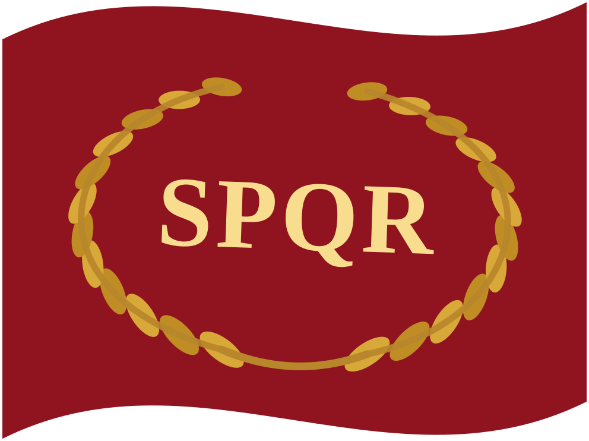 **Latine** · 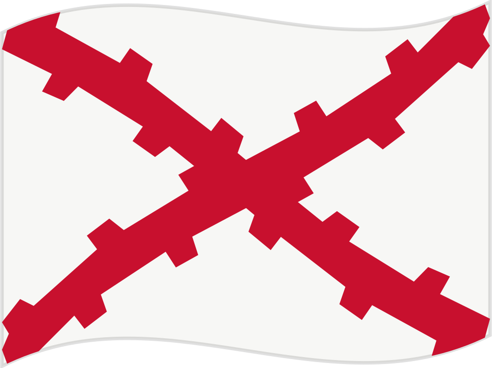 **[Español](../es/README.md)** ·  **[English](../en/README.md)**

# 𝕱𝖗𝖆𝖓𝖈𝖔 𝕲𝖚𝖙𝖎𝖊́𝖗𝖗𝖊𝖟

**Discipulus scientiae computatralis in Universitate Chilensi (DCC/FCFM).**

*Studens systematibus, fonti aperto, systematibus generis Unix et arti ingeniariae programmaturae.*

📍 Santiago, Chile

---

## De me

Scientiae computatrali in **Universitate Chilensi** studeo, in
Departimento Scientiarum Computatralium (**DCC**) Facultatis
Scientiarum Physicarum et Mathematicarum (**FCFM**).

Praecipue me tenent systemata, programmatura libera et aperta,
systemata operandi generis Unix, et ars ingeniaria programmaturae.
Plerumque e cortice imperatorio laboro, **Neovim** utens.

## Nunc

Studia mea in [**Universitate Chilensi**](https://uchile.cl/) praecipua
mihi cura sunt, simul cum operibus programmaturae propriis et labore meo
apud [**Venturas**](https://venturas.cl/).

## Universitas

<table>
<tr><td><b>Curriculum</b></td><td>Scientia computatralis et ars ingeniaria</td></tr>
<tr><td><b>Departimentum</b></td><td>Scientiarum computatralium (DCC)</td></tr>
<tr><td><b>Facultas</b></td><td>Scientiarum physicarum et mathematicarum (FCFM)</td></tr>
<tr><td><b>Universitas</b></td><td>Universitas Chilensis</td></tr>
</table>

## Computatio

<table>
<tr><td><b>Scriptorium</b></td><td>Neovim</td></tr>
<tr><td><b>Systemata</b></td><td>GNU/Linux, BSD</td></tr>
<tr><td><b>In manibus</b></td><td>C, Python, Scala, Kotlin</td></tr>
<tr><td><b>Tela et notatio</b></td><td>HTML, CSS, JavaScript, Markdown</td></tr>
</table>

## Opera

<table>
<tr>
<td width="96" align="center"></td>
<td>
<b>gentoo-musl-install-guide</b> 
Scriptura provecta de institutione Gentoo in systematibus musl et AMD64,
quae OpenRC, LUKS2, Btrfs, LLVM/Clang, ThinLTO et nucleum Zen complectitur. 
<a href="https://github.com/fraxgut/gentoo-musl-install-guide"><b>fraxgut/gentoo-musl-install-guide &rarr;</b></a>
</td>
</tr>
<tr>
<td width="96" align="center"></td>
<td>
<b>phosphor</b> 
Pales colorum pro terminali super scalam neutram calidam, ut rationes
Base16 et Base24, in septendecim formis. 
<a href="https://github.com/fraxgut/phosphor"><b>fraxgut/phosphor &rarr;</b></a>
</td>
</tr>
</table>

[**Omnia repositoria publica →**](https://github.com/fraxgut?tab=repositories)

## Negotia

<table>
<tr>
<td width="96" align="center"></td>
<td>
<b>Venturas</b> 
Ubi opera mea mercatoria servo. 
<a href="https://venturas.cl/"><b>venturas.cl &rarr;</b></a>
</td>
</tr>
</table>

## Epistulae

 
 
 

Epistula optima via est ad me contingendum. Respondeo cum primum possum.

## Subsidium

Opus meum publicum per [**Liberapay**](https://liberapay.com/fraxgut/)
vel per nummos cryptographicos sustinere potes.

**Monero (XMR) praelatum.** Scribe mihi ut inscriptionem accipias.

---

<a href="https://institutonacional.cl/">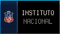</a> <a href="https://www.uchile.cl/">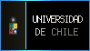</a> <a href="https://ingenieria.uchile.cl/">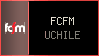</a> <a href="https://www.dcc.uchile.cl/">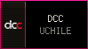</a> <a href="https://www.linux.org/">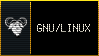</a> <a href="https://www.openbsd.org/">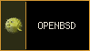</a> 

  </a>   <a href="https://www.minecraft.net/">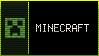</a> <a href="https://es.dragon-ball-official.com/">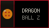

<a href="https://www.thelatinlibrary.com/">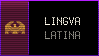</a> <a href="https://www.santiagocapital.cl/">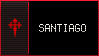</a> <a href="https://www.marcachile.cl/">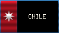</a> <a href="https://laroja.cl/">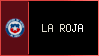</a> <a href="https://www.sslazio.it/">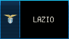</a>  <a href="https://www.linkinpark.com/">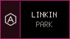</a>

---

 

