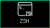
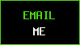
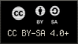

<!--
i18n/la/README.md
@fraxgut
CC-BY-SA-4.0
Extended profile in Latin
-->

 **Latine** ·  **[Español](../es/README.md)** ·  **[English](../en/README.md)**

# 𝕱𝖗𝖆𝖓𝖈𝖔 𝕲𝖚𝖙𝖎𝖊́𝖗𝖗𝖊𝖟

**Discipulus scientiae computatralis in Universitate Chilensi (DCC/FCFM).**

*Studens systematibus, fonti aperto, systematibus generis Unix et arti ingeniariae programmaturae.*

📍 Santiago, Chile

---

## De me

Scientiae computatrali in **Universitate Chilensi (DCC/FCFM)**,
Sanctiacobi, studeo.

Praecipue me tenent systemata, ars ingeniaria programmaturae,
programmatura libera et aperta, et ambitus generis Unix. Plerumque e
cortice imperatorio laboro, **zsh** et **Neovim** utens.

## Universitas

<table>
<tr><td><b>Curriculum</b></td><td>Scientia computatralis et ars ingeniaria</td></tr>
<tr><td><b>Departimentum</b></td><td>Scientiarum computatralium (DCC)</td></tr>
<tr><td><b>Facultas</b></td><td>Scientiarum physicarum et mathematicarum (FCFM)</td></tr>
<tr><td><b>Universitas</b></td><td>Universitas Chilensis</td></tr>
<tr><td><b>Locus</b></td><td>📍 Sanctiacobum, in Chile</td></tr>
</table>

## Computatio

<table>
<tr><td><b>Cortex</b></td><td>zsh, ksh</td></tr>
<tr><td><b>Scriptorium</b></td><td>Neovim</td></tr>
<tr><td><b>Systemata</b></td><td>GNU/Linux, BSD</td></tr>
<tr><td><b>In manibus</b></td><td>C, Python, Scala, Kotlin</td></tr>
<tr><td><b>Tela et notatio</b></td><td>HTML, CSS, JavaScript, Markdown</td></tr>
</table>

## Opera

<table>
<tr>
<td width="96" align="center"></td>
<td>
<b>gentoo-musl-install-guide</b> 
Scriptura provecta de institutione Gentoo in systematibus musl et AMD64,
quae OpenRC, LUKS2, Btrfs, LLVM/Clang, ThinLTO et nucleum Zen complectitur. 
<a href="https://github.com/fraxgut/gentoo-musl-install-guide"><b>fraxgut/gentoo-musl-install-guide &rarr;</b></a>
</td>
</tr>
<tr>
<td width="96" align="center"></td>
<td>
<b>frankifuscus</b> 
Ratio colorum propria secundum base16, tam plena quam unicolor. 
<a href="https://github.com/fraxgut/frankifuscus"><b>fraxgut/frankifuscus &rarr;</b></a>
</td>
</tr>
</table>

[**Omnia repositoria publica →**](https://github.com/fraxgut?tab=repositories)

## Venturas

**[Venturas](https://venturas.cl/)** rego, ubi opera mea mercatoria servo.

## Nexus

   

   

   

## Epistulae

  

Epistula: [franco.gutierrez.1@ug.uchile.cl](mailto:franco.gutierrez.1@ug.uchile.cl)

## Subsidium

Opus meum publicum per [**Liberapay**](https://liberapay.com/fraxgut/)
vel per nummos cryptographicos sustinere potes.

**Monero (XMR) praelatum.** Scribe mihi ut inscriptionem accipias.

---

 

